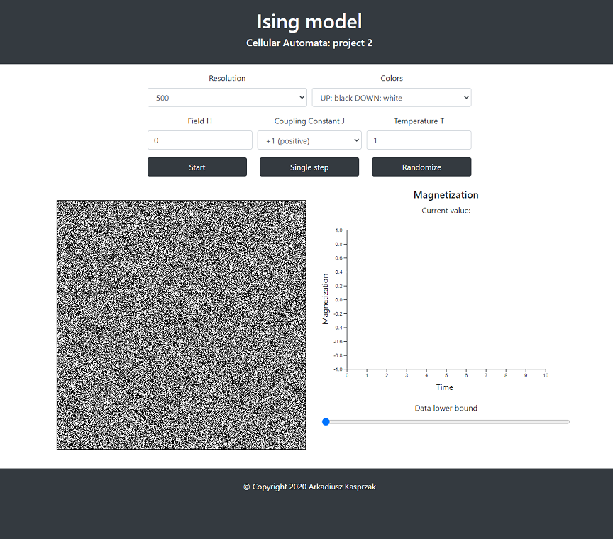

# Ising Model using Cellular Automata

This repository contains my second Cellular Automata project - implementation of 2D Ising Model (model of interacting magnetic spins). Project has been implemented as a simple client application that uses:
 * `JavaScript` (ES6)
 * `HTML5` (with `<canvas>`) and `CSS`
 * [`Bootstrap`](https://getbootstrap.com/)
 * [`D3.js`](https://d3js.org/)

All necessary dependencies are available in this repository (`src/resources` directory), so there is no need to download any additional libraries. 

#### Usage
To run this project simply:
1. Clone this repository.
2. Go to `src` directory and open `index.html` file using your browser. You should see this:

While using this project you can:
 * change simulation resolution (4 possible values)
 * change colors that indicate *up* and *down* spin
 * change value of external magnetic field *H*
 * change sign of coupling constant *J*
 * change temperature *T*
 * start/stop the simulation
 * perform single step of the simulation
 * randomize simulation's state

On the left side of the page you can see the simulation itself, and on the right side magnetization chart is displayed.

#### Repository content
 * `src` - project source code
 * `src/resources` - external dependencies (`Bootstrap` and `D3.js`)
 * `report` - project report (in polish because it was a part of university course)
 * `images` - `.png` images used in this Readme